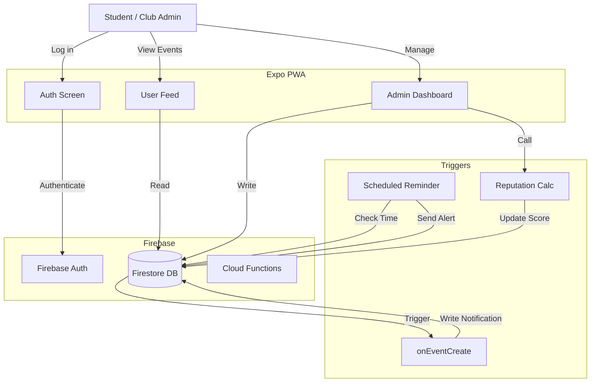

# System Architecture

```mermaid
graph TD
    User[Student / Club Admin]
    
    subgraph Frontend [Expo PWA]
        AuthUI[Auth Screen]
        Feed[User Feed]
        AdminUI[Admin Dashboard]
    end
    
    subgraph Backend [Firebase]
        Auth[Firebase Auth]
        Firestore[(Firestore DB)]
        Functions[Cloud Functions]
    end
    
    subgraph Triggers
        cron[Scheduled Reminder]
        create[onEventCreate]
        calc[Reputation Calc]
    end

    User -->|Log in| AuthUI
    AuthUI -->|Authenticate| Auth
    
    User -->|View Events| Feed
    Feed -->|Read| Firestore
    
    User -->|Manage| AdminUI
    AdminUI -->|Write| Firestore
    
    Firestore -->|Trigger| create
    create -->|Write Notification| Firestore
    
    cron -->|Check Time| Firestore
    cron -->|Send Alert| Firestore
    
    AdminUI -->|Call| calc
    calc -->|Update Score| Firestore
```
